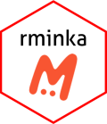

<!-- README.md is generated from README.Rmd. Please edit that file -->

```{r, include = FALSE}
knitr::opts_chunk$set(
  collapse = TRUE,
  comment = "#>",
  fig.path = "man/figures/README-",
  out.width = "100%"
)
```

# rminkav5 <a href="https://dplyr.tidyverse.org"></a>

<!-- badges: start -->
[](https://github.com/Raiservi/rminkav5/actions/workflows/R-CMD-check.yaml)
[](https://app.codecov.io/gh/Raiservi/rminkav5)
[](https://lifecycle.r-lib.org/articles/stages.html#stable)
[](https://www.gnu.org/licenses/gpl-3.0)
[](https://github.com/Raiservi/rminkav5/commits/main)
<br>
[](https://zenodo.org/records/18909175)
[](https://app.dimensions.ai/details/publication/pub.1165278788)
[](https://www.contributor-covenant.org/version/2/1/code_of_conduct/)
<br>
[](https://github.com/Raiservi/rminkav5)
[](https://github.com/Raiservi/rminkav5/releases)
[](https://github.com/Raiservi/rminkav5/graphs/contributors)
<!-- badges: end -->

## Usage

Minka is a citizen science app built for recording, organizing and sharing naturalistic observations of animals and plants. It allows anyone to become a researcher and that the observations we make serve for scientific use. Minka also allows users to create their own projects. The link to access Minka's website is [https://minka-sdg.org/](https://minka-sdg.org/)

The goals of the `rminka`  package are:

1. Directly access the data stored in Minka to be able to process them with R through the API.

1. Treat the data to be able to use them directly with other packages such as `vegan` or `dismo`.


## Overview

`rminkav5` is a toolkit for interacting with the Minka API, providing a consistent set of functions to help you query and retrieve biodiversity data. The package's functions are grouped by the type of data they return:

**a) Project Queries:** A set of complementary functions to find projects and their associated observations.
*   `mnk_proj_byname()` finds a project's ID using an approximate project name.
*   `mnk_proj_info()` retrieves detailed project information using its known ID.
*   `mnk_proj_obs()` fetches all observations for a specific year within that project.

**b) User Queries:** Functions to find users and their contributed observations.
*   `mnk_user_byname()` finds a user's ID from their approximate login name.
*   `mnk_user_obs()` retrieves all observations contributed by that user for a given year.

**c) Place Queries:** Functions to find places and retrieve their spatial data.
*   `mnk_places_byname()` finds the ID for a location using an approximate place name.
*   `mnk_place_sf()` returns the `sf` geometry for a place, ready for plotting with packages like `ggplot2` or `leaflet`.

**d) Observation Queries:** A variety of functions to fetch observation data based on different parameters.
*   `mnk_obs_id()` retrieves a single observation's complete data using its unique ID.
*   `mnk_obs()` fetches observations based on various parameters for a full year, a specific month, or a single day.
*   `mnk_obs_bydays()` retrieves all observations within a date range in the same year.

These functions are designed to be used together. For queries that span multiple years, you can easily loop through the years of interest, run the appropriate function, and then combine the resulting tibbles with `dplyr::bind_rows()`.


## Installation

You can install the development version of rminkav5 from [GitHub](https://github.com/) with:

``` r
# install.packages("pak")
pak::pak("Raiservi/rminkav5")
```


## Using rminka

If you are new to `rminka` you are better off starting with a starting web page of `rminka` in the github page of the project.

1. The main page directions is [rminka website](https://development-biomarine.github.io/rminkav3/)

1. The starting web page is [rminka starting](https://development-biomarine.github.io/rminkav3/articles/rminkav3.html)


## Getting help

There are two main places to get help with `rminka`:

1.  The [RStudio community][community] is a friendly place to ask any
    questions about R.

1.  [Stack Overflow][so] is a great source of answers to common R
    questions. It is also a great place to get help, once you have
    created a reproducible example that illustrates your problem.

[community]: https://forum.posit.co/
[so]: https://stackoverflow.com/

If you encounter a clear bug, please file an issue with a minimal reproducible example on [GitHub](https://github.com/tidyverse/dplyr/issues). 


## Code of conduct

Please note that this project is released following a [Code of Conduct](CODE_OF_CONDUCT.md).
By participating in this project you agree to abide by its terms.
